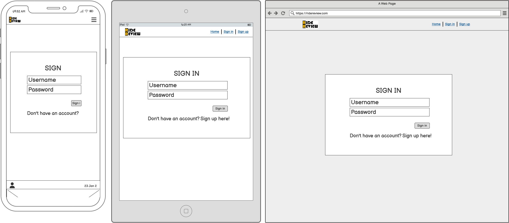

extra packages I used

npm install --save @fortawesome/fontawesome-svg-core
npm install --save @fortawesome/free-solid-svg-icons
npm install --save @fortawesome/free-regular-svg-icons
npm install --save @fortawesome/react-fontawesome

# About

The Ride Review project aims to provide users with a platform to share their experiences and reviews of various rides with cars. Leveraging modern web technologies and React components, Ride Review offers an intuitive interface for users to create, browse, and interact with ride reviews. Whether it's sharing insights on a recent road trip or rating the comfort of a new car model, Ride Review empowers users to contribute to a community-driven database of car reviews. With its user-friendly design and robust features, Ride Review brings together enthusiasts, commuters, and travelers alike to exchange valuable information and make informed decisions about their rides.

## Project Goals

The key functionality aspects:

- simple and intuitive navigation across all pages
- user authentication
- user interaction via posts, comments, likes, followers
- user profiles with their description and images
- CRUD functionality for posts, comments, likes and profile information
- posts filtering by brand, model, production year, other details
- posts filtering by liked posts and followed users posts

### User Goals

- Ability to post a post
- Be able to comment on a post
- Ability to amend and update content
- Ability to rate along with commenting a post
- Able to like a post
- Able to follow a user

## User Experience

### Target Audience

- Everybody who want to share riding experience of a car
- Everybody who want to buy a car and need to know about different brands of cars

### User stories

#### Profile Page

1. **Profile Page**: As a user, I can view other users profiles so that I can see their posts and learn more about them.
2. **Most Followed Profiles**: As a user, I can see a list of the most followed profiles so that I can see which profiles are popular.
3. **User Profile - User Stats**: As a user, I can view statistics about a specific user: bio, favorite car, number of posts, follows and users followed so that I can learn more about them.
4. **Follow/Unfollow a User**: As a logged-in user, I can follow and unfollow other users so that I can see and remove posts by specific users in my posts feed.
5. **View All Posts by a Specific User**: As a user, I can view all the posts by a specific user so that I can catch up on their latest posts, or decide I want to follow them.
6. **Edit Profile**: As a logged-in user, I can edit my profile so that I can change my profile picture, bio, username, and password.
7. **Update Username and Password**: As a logged-in user, I can update my username and password so that I can change my display name and keep my profile secure.

#### Navigation and Authentication

1. **View Navbar**: As a user, I can view a navbar from every page so that I can navigate easily between pages.
2. **Create Account**: As a user, I can create a new account so that I can access all the features for signed-up users.
3. **Sign In**: As a user, I can sign in to the app so that I can access functionality for logged-in users.
4. **Sign Up**: As a user, I can create a new account so that I can access all the features for signed-up users.
5. **Logged-in Status**: As a user, I can tell if I am logged in or not so that I can log in if I need to.
6. **Refreshing Access Tokens**: As a user, I can maintain my logged-in status until I choose to log out so that my user experience is not compromised.
7. **Conditional Rendering**: As a logged-out user, I can see sign-in and sign-up options so that I can sign in/sign up.
8. **Avatar**: As a user, I can view user's avatars so that I can easily identify users of the application.

#### Adding and Liking Posts

1. **Create Posts**: As a logged-in user, I can create posts so that I can share my experience with the world.
2. **View a Post**: As a user, I can view the details of a single post so that I can learn more about it.
3. **Like a Post**: As a logged-in user, I can like a post so that I can show my support for the posts that interest me.

#### Post Page

1. **Post Page**: As a user, I can view the post page so that I can read the comments about the post.
2. **Edit a post**: As a post owner, I can edit my post content so that I can make corrections or update my post after it was created.
3. **Delete a post**: As a post owner, I can delete my post so that I can remove my post after it was created.
4. **Create a comment**: As a logged in user, I can add comments to a post so that I can share my thoughts about the post.
5. **Comment date**: As a user, I can see how long ago a comment was made so that I know how old a comment is.
6. **View comments**: As a user, I can read comments on posts so that I can read what other users think about the posts.
7. **Delete comments**: As an owner of a comment, I can delete my comment so that I can control removal of my comment from the application.
8. **Edit a comment**: As an owner of a comment, I can edit my comment so that I can fix or update my existing comment.

#### The Posts Page

1. **View Most Recent Posts**: As a user, I can view all the most recent posts, ordered by most recently created first so that I am up to date with the newest content.
2. **Search for Posts**: As a user, I can search for posts with keywords so that I can find the posts and user profiles I am most interested in.
3. **View Liked Posts**: As a logged-in user, I can view the posts I liked so that I can find the posts I enjoy the most.
4. **View Posts of Followed Users**: As a logged-in user, I can view content filtered by users I follow so that I can keep up to date with what they are posting about.
5. **Infinite Scroll**: As a user, I can keep scrolling through the images on the site, that are loaded for me automatically so that I don't have to click on "next page" etc.

## Wireframes

- A low-fi wireframe was build before developing the website.
- This was done in Balsamiq Wireframes.
- Most of the pages has same design so a basic wireframe was created for the following pages:
- Home page also used for feed and interested page
- Add/edit page also used for add events, edit events and edit profile

Home Page logged out

Home Page logged in

Signin Page

Signup Page

Profile Page

Post detail Page

Add/edit form page

Change username Page

Change password Page

## Technologies Used

### Languages

- HTML
- CSS
- Javascript
  - React (17.0.2)
