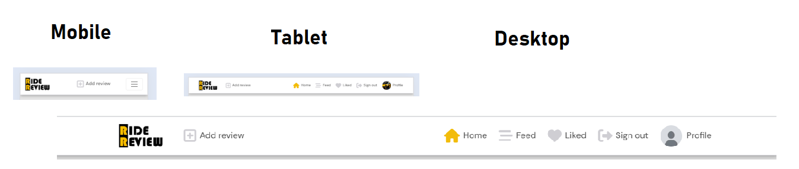
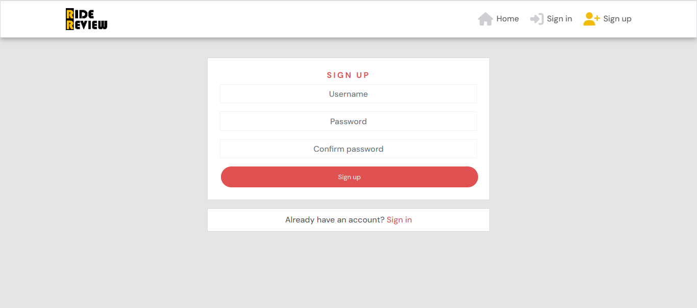

extra packages I used

npm install --save @fortawesome/fontawesome-svg-core
npm install --save @fortawesome/free-solid-svg-icons
npm install --save @fortawesome/free-regular-svg-icons
npm install --save @fortawesome/react-fontawesome

# About

The Ride Review project aims to provide users with a platform to share their experiences and reviews of various rides with cars. Leveraging modern web technologies and React components, Ride Review offers an intuitive interface for users to create, browse, and interact with ride reviews. Whether it's sharing insights on a recent road trip or rating the comfort of a new car model, Ride Review empowers users to contribute to a community-driven database of car reviews. With its user-friendly design and robust features, Ride Review brings together enthusiasts, commuters, and travelers alike to exchange valuable information and make informed decisions about their rides.

## Project Goals

The key functionality aspects:

- simple and intuitive navigation across all pages
- user authentication
- user interaction via posts, comments, likes, followers
- user profiles with their description and images
- CRUD functionality for posts, comments, likes and profile information
- posts filtering by brand, model, production year, other details
- posts filtering by liked posts and followed users posts

### User Goals

- Ability to post a post
- Be able to comment on a post
- Ability to amend and update content
- Ability to rate along with commenting a post
- Able to like a post
- Able to follow a user

## User Experience

### Target Audience

- Everybody who want to share riding experience of a car
- Everybody who want to buy a car and need to know about different brands of cars

### User stories

#### Profile Page

1. **Profile Page**: As a user, I can view other users profiles so that I can see their posts and learn more about them.
2. **Most Followed Profiles**: As a user, I can see a list of the most followed profiles so that I can see which profiles are popular.
3. **User Profile - User Stats**: As a user, I can view statistics about a specific user: bio, favorite car, number of posts, follows and users followed so that I can learn more about them.
4. **Follow/Unfollow a User**: As a logged-in user, I can follow and unfollow other users so that I can see and remove posts by specific users in my posts feed.
5. **View All Posts by a Specific User**: As a user, I can view all the posts by a specific user so that I can catch up on their latest posts, or decide I want to follow them.
6. **Edit Profile**: As a logged-in user, I can edit my profile so that I can change my profile picture, bio, username, and password.
7. **Update Username and Password**: As a logged-in user, I can update my username and password so that I can change my display name and keep my profile secure.

#### Navigation and Authentication

1. **View Navbar**: As a user, I can view a navbar from every page so that I can navigate easily between pages.
2. **Create Account**: As a user, I can create a new account so that I can access all the features for signed-up users.
3. **Sign In**: As a user, I can sign in to the app so that I can access functionality for logged-in users.
4. **Sign Up**: As a user, I can create a new account so that I can access all the features for signed-up users.
5. **Logged-in Status**: As a user, I can tell if I am logged in or not so that I can log in if I need to.
6. **Refreshing Access Tokens**: As a user, I can maintain my logged-in status until I choose to log out so that my user experience is not compromised.
7. **Conditional Rendering**: As a logged-out user, I can see sign-in and sign-up options so that I can sign in/sign up.
8. **Avatar**: As a user, I can view user's avatars so that I can easily identify users of the application.

#### Adding and Liking Posts

1. **Create Posts**: As a logged-in user, I can create posts so that I can share my experience with the world.
2. **View a Post**: As a user, I can view the details of a single post so that I can learn more about it.
3. **Like a Post**: As a logged-in user, I can like a post so that I can show my support for the posts that interest me.

#### Post Page

1. **Post Page**: As a user, I can view the post page so that I can read the comments about the post.
2. **Edit a post**: As a post owner, I can edit my post content so that I can make corrections or update my post after it was created.
3. **Delete a post**: As a post owner, I can delete my post so that I can remove my post after it was created.
4. **Create a comment**: As a logged in user, I can add comments to a post so that I can share my thoughts about the post.
5. **Comment date**: As a user, I can see how long ago a comment was made so that I know how old a comment is.
6. **View comments**: As a user, I can read comments on posts so that I can read what other users think about the posts.
7. **Delete comments**: As an owner of a comment, I can delete my comment so that I can control removal of my comment from the application.
8. **Edit a comment**: As an owner of a comment, I can edit my comment so that I can fix or update my existing comment.

#### The Posts Page

1. **View Most Recent Posts**: As a user, I can view all the most recent posts, ordered by most recently created first so that I am up to date with the newest content.
2. **Search for Posts**: As a user, I can search for posts with keywords so that I can find the posts and user profiles I am most interested in.
3. **View Liked Posts**: As a logged-in user, I can view the posts I liked so that I can find the posts I enjoy the most.
4. **View Posts of Followed Users**: As a logged-in user, I can view content filtered by users I follow so that I can keep up to date with what they are posting about.
5. **Infinite Scroll**: As a user, I can keep scrolling through the images on the site, that are loaded for me automatically so that I don't have to click on "next page" etc.

## Wireframes

- A low-fi wireframe was build before developing the website.
- This was done in Balsamiq Wireframes.
- Most of the pages has same design so a basic wireframe was created for the following pages:
- Home page also used for feed and interested page
- Add/edit page also used for add posts, edit posts and edit profile

Home Page logged out

Home Page logged in

Signin Page

Signup Page

Profile Page

Profile Edit Page

Post detail Page

Add/edit form page

Change username Page

Change password Page

## Technologies Used

### Languages

- HTML
- CSS
- Javascript
  - React (17.0.2)

### Libraries, frameworks and dependencies

- [Axios](https://axios-http.com/docs/intro) - axios were used for promise-based HTTP. Justification: I used axios to send API requests from the React project to the API and avoid any CORS errors when sending cookies.
- [ClassNames](https://www.npmjs.com/package/classnames/) - JavaScript utility for conditionally joining classNames together, used in the FeedbackMsg component. This is used to apply the styles dynamically based on the type of style and apply more than one style to elements in FeedbackMsg component
- [JWT](https://jwt.io/) - library to decode out JSON Web token. Justification: I used JWT to prevent unauthenticated user from making extra network requests to refresh their access token. Also used to remove the timestamp from the browser when the user refreshes token expires or the user logs out.
- [Popper](https://popper.js.org/) - a 3rd party library used by React-Bootstrap. Justification: I used Popper to make sure the dropdown menus position is fixed on all browsers.
- [React 17](https://17.reactjs.org/) - JavaScript library for building user interfaces
- [React-Bootstrap 4.6](https://react-bootstrap-v4.netlify.app/) - Justification: I used Bootstrap React library for UI components, styling and responsiveness.
- [React Infinite Scroll](https://www.npmjs.com/package/react-infinite-scroll-component) - Justification: I used this component to load content (posts/comments) automatically as the user scrolls towards the bottom of the page without having to jump to next/previous page.
- [React Router](https://v5.reactrouter.com/web/guides/quick-start) - used for dynamic routing. Justification: I used this library to enable the navigation among views of various components and control what the user sees depending on the URL they have accessed in the browser.
- [Prettier](https://prettier.io/): This extension was used to format code for all files

### Tools & Programs

- [Am I Responsive](http://ami.responsivedesign.is/) was used to create the multi-device mock-up at the top of this README.md file
- [Balsamiq](https://balsamiq.com/) to create the projects wireframes
- [Chrome dev tools](https://developers.google.com/web/tools/chrome-devtools/) was used for debugging of the code and checking site for responsiveness
- [Cloudinary](https://cloudinary.com/) to store static files
- [Coolors](https://coolors.co/?home) was used to create the color scheme palette
- [Favicon.io](https://favicon.io) for making the site favicon
- [Font Awesome](https://fontawesome.com/) - Icons from Font Awesome were used throughout the site
- [Google Fonts](https://fonts.google.com/) - import of font for the website
- [Gitpod](https://gitpod.io/) was IDE used for writing code and to push the code to GitHub
- [GitHub](https://github.com/) was used as a remote repository to store project code
- Validation:
  - [WC3 Validator](https://validator.w3.org/) was used to validate the html
  - [Jigsaw W3 Validator](https://jigsaw.w3.org/css-validator/) was used to validate the css
  - [ESLint](https://eslint.org/) used to validate JSX code
  - [Lighthouse](https://developers.google.com/web/tools/lighthouse/) used to validate performance, accessibility, best practice and SEO of the app

##### Back to [top](#table-of-contents)

## Agile design

### About

- Agile development is the most effective way to development of any website
- This was able to do basic development of website using user story template

### User Story Template

- Using Github issues first I created the template for a user story that was later used to create user stories. I created three labels: must have, could have, should have.

See User story template

### Kanban Board

- As a visual representation of the project's status, showing what tasks are to be done, in progress and completed.Each task is represented as a card on the board, and the cards can be moved from one column to another to show progress.

See Kanban board

### Moscow Prioritisation

- The Moscow prioritization technique is used to prioritize project requirements based on their importance.

See Image

### Milestones

- Milestones are created with a aim of finishing a task on a certain date. I have created 6 milestones for this project and linked them with issues related.

See Image

## Design

### Colours

- I have tried to keep the color of the website simple, light and in matching with the logo.
- I tried to find the similar palette using [Coolors](https://coolors.co/?home)

See General Color Palette

See Sign in/up Color Palette

### Fonts

- Google fonts "DM Sans", sans-serif; font were used for this project as it offers clean and legible design, which makes it easy to read on screens of different sizes and resolutions. It has a neutral appearance and doesn't have any distracting features that can make it difficult to read.

See DM Sans

## Project Structure

### Front-End

#### React

React is a declarative, efficient, and flexible JavaScript library for building user interfaces. Its primary goal is to make it easy to reason about an interface and its state at any point in time, by dividing the UI into a collection of independent and reusable components ([source](https://www.freecodecamp.org/news/the-react-handbook-b71c27b0a795/)).

There were various components created and reused across this application.

- `<Asset />` - multi purpose component, used to display a range of items due to being passed props.

  - Those include a loading spinner from React Bootstrap, image with source and alt attribute or a message consisting of a paragraph.

- `<Avatar />` - resuable component, used to display the relevant user profile picture.

  - This component uses props which can specify the source of the image and also its size
  - This components was used in profile avatar, post owner, comment create form and comments posted

- `<DropDowns />` - resuable component, used to display the three dots option button based on the required rights of the user.

  - This was used for user who are authorised to make changes. For example, for user to edit and delete their own comments and user to edit their profile, change their username and password.

- `<EditStars />` - resuable component, used to display editable stars while editing comments.

  - This component uses props which can get the stars value for farther process.
  - This component was used in when user edit their ratings in while editing comment successfully.

- `<BrandChoices />` - resuable component, used to display choices while creating new post in brand input field.

  - This component was used in when user select a year in production field in post create form.

- `<ProductionYearChoices />` - resuable component, used to display choices while creating new post in production input field.

  - This component was used in when user select a car brand name in brand field in post create form.

- `<RatingsAverageStar />` - resuable component, used to reperesent rating average by stars in post component.

  - This component was used in when a post is displayed.

- `<ShowStarsInCommentList />` - resuable component, used to display rate of each user by stars in comment list.

  - This component was used in when comment list is created.

- `<StarRating />` - resuable component, used to able user to rate a post by selecting stars while commenting.

  - This component was used in when user rate a post.

- `<NavBar />` - resuable component, used for easy navigation of the site.

  - This component is reusable as it will display different icons based on a users logged in status.
  - If no user is logged in a log in, sign up and contact icon will be available however if a user is currently logged in, the full range of icons will be available apart from log in.

- `<PageNotFound />` - specific component, used to display a 404 page made up of an image file and return home button for when the page does not exist.

There were various pages created and used in this application

- auth - The auth page group consisted of the following files:

  - SignInForm.js - This file handles the Login form
  - SignUpForm.js - This file handles the Sign up form

- comments - The comments page group consisted of the following files:

  - Comment.js - This file returns the comments
  - CommentEditForm.js - This file handles the comment edit form
  - CommentCreateForm.js - This file handles the create comment form

- posts - The posts page group consisted of the following files:

  - post.js - This file returns the post and all its related info
  - postCreateForm.js - This file handles the post create form
  - postEditForm.js - This file handles the post edit form
  - postPage.js - This file handles the post detail
  - postsPage.js - This file returns the list of posts

- profiles - The profiles page group consisted of the following files:

  - Profile.js - This file returns the profile section
  - ProfilePage.js - This file returns the entire Profile page
  - PopularProfiles.js - This file returns the users of the site as per the posts count they posted

  - ProfileEditForm.js - This file handles the profile edit form
  - UsernameForm.js - This file handles the username change form
  - UserPasswordForm.js - This file handles the password change form

### Back-End API

#### Django REST Framework

The API for this Front-End application was built with the Django REST Framework. The repository with a README file for the DRF Back-End can be found [here](https://github.com/strasse34/pp5-drf-api).

## Features

### Implemented Features

#### Navigation(Navbar)

- Navbar consists of Logo image and is displayed in all pages for easy navigation of website
- Navbar consists of name of website which is displayed in larger device
- Logo and website name both are links for home page
- Navbar consists of a links to a signin page and signup page for logged out users
- Authenticated/Signed in user can see additional icons as follows:
  - Add Review: It opens the post create form page
  - Feed: It shows the posts created of all users whom the logged in user has followed
  - Liked: It shows the posts user has liked
  - Logout: This is used for user to logout
  - Profile: This shows the user avatar and opens the user's profile page
- Feature is fully responsive and on smaller screen sizes it coverts into a 'Hamburger menu'

See Nav-bar logged out

See Nav-bar logged in

#### Sign Up Page

- This page consists of sign up form for user to create new account
- New users can access this page by clicked on SignUp link on Navbar
- User Story covered: 2

See Sign Up Page

#### Sign In Page

- This page consists of sign in form for existing user to signin using their credentials
- Users can access this page by clicking on SignIn link on Navbar
- User Stories covered: 3

See Sign In Page

#### HomePage

- This page consists of four components as follows
  - Popular Profiles
  - Review Posts
  - Search form and filters

See HomePage logged out

See HomePage logged in

##### Popular Profiles

- This component is displayed on right side of the page in larg screen and at the top in small screen
- This component uses filter to order all the site users by followers count
- Logged in users can follow and unfollow users from here as well
- User can click on these profiles avatar and see profile page of them

##### Posts Page

- All posts created by users are displayed here.
- This component has infinite scroll functionality for user to scroll to view posts created and do not have to click for going to next page
- The post created is in form of a card and displays following:
  - post owener avatar
  - Image of post
  - Car brand, model, other detaisl, production year and post owner experience
  - likes, comments and rating average
  - Logged in user and not post owner can show interest and add his number in attendance list

See posts page

#### Feed Page

- The feed page looks identical to the homepage, only the posts component changes.
- In this page all the posts displayed by filtering the posts created by the users logged in user is following
- It is the same as posts page but Feed icon is active

#### Liked Page

- The liked page looks identical to the homepage, only the posts component changes
- In this page all the posts displayed by filtering logged in user is has shown interest to
- It is the same as posts page but Liked icon is active

##### Search-bar

- This component is provided for user to search all posts easily by their brand, model, other detaisl and production year
- User can also type other user's name and see all posts posted by them

See Search form and filters Section

#### post Detail Page

- This page consist a detail view of post created by users
- Users can click on post image in post card to open this page
- Logged in users can post comments on this page on posts and interact with other users
- post owner can edit and delete the post
- User can read full content about what the post is about

See post Detail Page

#### post Create Page

- This page consists of post create form where user can create an post
- Logged in user can open this page by clicking on 'add reivew' link on Navbar

See post Create Page

#### post Edit Page

- This page consists of post form where post owner can edit the data of the post
- post owner can access this page by clicking on edit icon in post detail page
- After successful update user is displayed successful message

See post Edit Page

#### Profile Page

- This page consists the detail of user including their bio, following and followers counts and posts posted by that user
- User can access other's profile by clicking on avatar of other users
- Logged in user can access this page by clicking on their avatar image in Navbar

See Profile Page Logged out

See Profile Page Logged in

#### Profile Edit Page

- This page consists of profile form where loggedin user can update their profile data
- Profile owner can access this page by clicking on edit profile in their profile page
- After successful update user is displayed successful message

See Profile Edit Page

#### Change Username Page

- This page consists of username change form where loggedin user can update their username
- Profile owner can access this page by clicking on change username in their profile page
- After successful update user is displayed successful message

See Change Username Page

#### Change Password Page

- This page consists of username change form where loggedin user can update their password
- Profile owner can access this page by clicking on change password in their profile page
- After successful update user is displayed successful message

See Change Password Page

#### Page Not Found

- This page occurs when there is an 404 error
- This consists of an image and a button with a link to go back to home page
- After successful update user is displayed successful message
- User Stories covered: 31

PageNotFound Page

### Features to be Implemented

- Reply feature to the comment lists to provide chances to the users to reply a comment.
- Filter option feature to order posts/cars according thier ratings.

## Validation

### CSS

- [Jigsaw W3 Validator](https://jigsaw.w3.org/css-validator/)was used to validate the css in the project.
- Validator with no errors.
- The deployed app was passed as url input for validation

Jigsaw validation using url

### Html

- [WC3 Validator](https://validator.w3.org/) was used to validate the html in the project
- The deployed app was passed as url input for validation
- No errors were found
- Note : info were provided regarding standard Meta code

HTML validation screenshot

No error screenshot

### Lighthouse

- [Lighthouse](https://developers.google.com/web/tools/lighthouse/) for performance, accessibility, progressive web apps, SEO analysis of the project code here are the results:

- While conducting lighthouse validation of profile edit page, username and password change page lighthouse was refreshing and testing the home page so I have not included the test results

- Note: Lighthouse results of testing the project may be inconsistent due to the functionality of user-uploaded images,Hosting project on Heroku may affected the results (server response time, caching, and network latency). Also additional external libraries reduce the response of the website. I will try improve in further projects to acheive better.

Home Desktop-screen

Home Mobile-screen

SignIn page Desktop-screen

SignIn page Mobile-screen

Sign up page Desktop-screen

Sign up page Mobile-screen

Feed Desktop-screen

Feed Mobile-screen

Interested Desktop-screen

Interested Mobile-screen

Profile page Desktop-screen

Profile page Mobile-screen

Event Detail Desktop-screen

Event Detail Mobile-screen

Create event Desktop-screen

Create event Mobile-screen

Edit event Desktop-screen

Edit event Mobile-screen

PageNotFound Desktop-screen

PageNotFound Mobile-screen

### ESLint Validation

- The JSX code was validated using the ESLint utility.
- The library was preinstalled in Codeanywhere IDE
- The code was getting validated so the errors were corrected during development process
- The library was also installed later using [ESLint website](https://eslint.org/) for final validation
- Few errors were shown which has been documented in Bug and fixes in TESTING.md
- No errors remained before final submission

Inbuild ESLint permission page

No error screenshot

## Testing

- Testing of the website can be [seen here](https://github.com/Sinha5714/humanitas-events-pp5/blob/main/TESTING.md)
